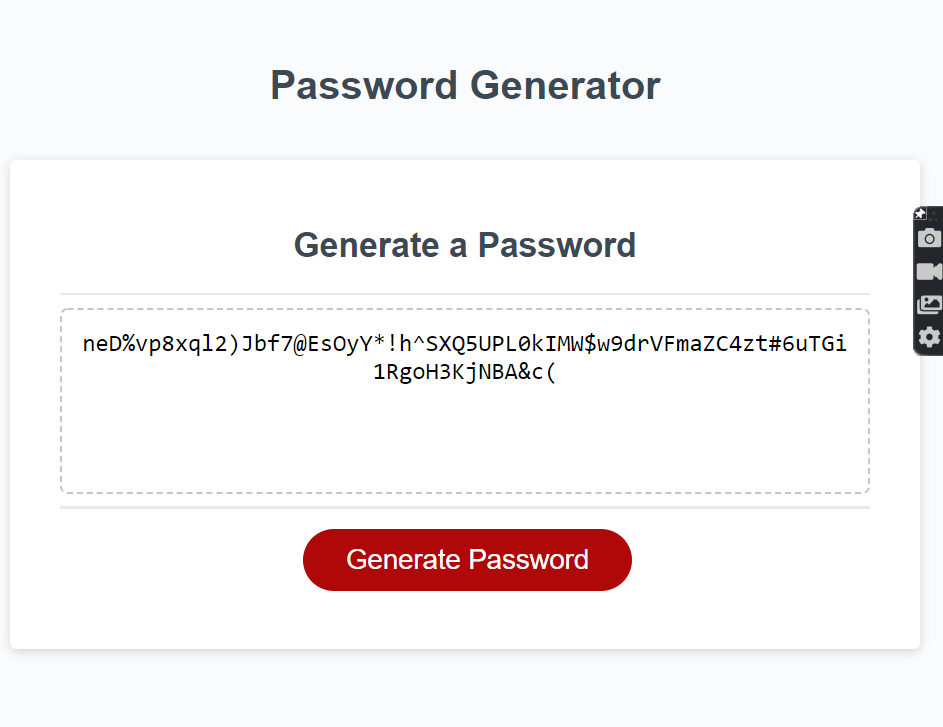

# Password Generator

## About this Project
This was a really fun project to play around with. I have more experience with using C++ (even though it was years ago), so some of the concepts like the Do-While Loops and returning values were already on my mind. I did need some semantic refreshers though! 

The goal for this assignment was to gather criteria from a user on what they wanted their password to include. I decided to play around with the prompt function and save the user inputs directly. Once I received the correct value (any number in between 8-128 characters, and had to be a number), I moved on to the next prompt and ensured that I had a the proper values.

The next step was to create a giant string that had all the users requirements included. This is where concatenate came into play and I combined everything into one bit string. 

The tricky part for me after this was randomizing everything. I ended up turning the string into an array, and used a random number generator to give me a random index to switch with my counter index. This was all done inside of a for loop to make sure that all the potential indexes were randomized to the best of the ability. 

Once the array was randomized, I turned the array back into a string, and then used the substring method to save the value and push it to the screen for the user to copy. 

I did make the mistake of going down the rabbit hole and attempted to make multiple arrays of ASCII values, however I found that to be a little too confusing, and went back to concatenating strings. 

I feel like I was able to have some fun with making functions and working with different types of loops. I would like to work more on traversing the DOM next time. 

## Built With:
- HTML
- CSS
- Visual Studio Code

## Contact
project link: (https://cpastorelli.github.io/Password-Generator/)

## License

## Acknowledgements
- [Button Click to Initiate Prompt](https://stackoverflow.com/questions/37287093/starting-a-javascript-prompt-after-a-button-is-clicked)
-[Event Handlers (Not inline)](https://developer.mozilla.org/en-US/docs/Learn/JavaScript/Building_blocks/Events)
- [Review of Onclick = "function()"](https://dev.to/code_mystery/random-password-generator-using-javascript-6a)
- [Getting User Input and Using Prompt](https://www.mikedane.com/web-development/javascript/getting-user-input/)
- [Ensure Number Validation](https://www.w3schools.com/js/tryit.asp?filename=tryjs_validation_number)
- [Returning Values from a Function](https://developer.mozilla.org/en-US/docs/Learn/JavaScript/Building_blocks/Return_values)
- [Do-While Loops](https://www.javascripttutorial.net/javascript-do-while/)
- [Random Number Generator](https://www.codegrepper.com/code-examples/javascript/javascript+random+number+between+0+and+9)
- [Substrings](https://www.w3schools.com/jsref/jsref_substring.asp)
- [Array of Characters](https://www.samanthaming.com/tidbits/83-4-ways-to-convert-string-to-character-array/)
- [Randomizing Array Values](https://www.codespeedy.com/shuffle-characters-of-a-string-in-javascript/)